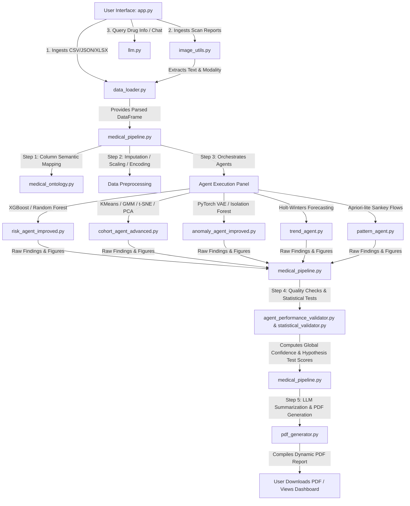

# 💊 Prescription Trend AI (PTAIV2) — Clinical Intelligence Platform

Prescription Trend AI is an advanced, production-grade clinical decision support and pharmaceutical data analytics dashboard. Built with a responsive **Streamlit** front-end, it integrates local machine learning pipelines, deep probabilistic anomaly detection (**PyTorch**), and a local Small Language Model (SLM) (**Phi-4-mini** via Ollama) to analyze structured medical datasets, drug profiles, and clinical scan reports.

---

## 🏗️ System Architecture

The following Mermaid diagram maps the end-to-end execution flow of the application:



---

## 📁 Repository Directory Structure

- 📄 [app.py](file:///c:/Users/athis/PTAIV2/app.py) — The main application script. Sets up the dark-themed Streamlit UI, maintains session state, handles dashboard tab switching (Drug Lookup, Dataset Analysis, Image Report), and coordinates pipelines.
- 📁 **`agents/`** — Contain the analytical engines of the system:
  - 📄 [risk_agent_improved.py](file:///c:/Users/athis/PTAIV2/agents/risk_agent_improved.py) — Leverages XGBoost and Random Forest algorithms to train medical risk predictors on features mapped from input datasets.
  - 📄 [cohort_agent_advanced.py](file:///c:/Users/athis/PTAIV2/agents/cohort_agent_advanced.py) — Performs patient segmentation using multi-algorithm clustering ensemble models.
  - 📄 [anomaly_agent_improved.py](file:///c:/Users/athis/PTAIV2/agents/anomaly_agent_improved.py) — Runs a PyTorch-based Variational Autoencoder (VAE) and IsolationForest to detect outliers in medical records.
  - 📄 [trend_agent.py](file:///c:/Users/athis/PTAIV2/agents/trend_agent.py) — Fits additive and multiplicative Holt-Winters time-series forecasts to prescription volumes.
  - 📄 [pattern_agent.py](file:///c:/Users/athis/PTAIV2/agents/pattern_agent.py) — Discovers co-prescription associations, calculating support/confidence and drawing Sankey flow diagrams.
- 📁 **`utils/`** — Core utility files supporting data orchestration, verification, and output generation:
  - 📄 [medical_pipeline.py](file:///c:/Users/athis/PTAIV2/utils/medical_pipeline.py) — Implements the strict 5-step analysis pipeline via the [MedicalDataPipeline](file:///c:/Users/athis/PTAIV2/utils/medical_pipeline.py#L13) class.
  - 📄 [medical_ontology.py](file:///c:/Users/athis/PTAIV2/utils/medical_ontology.py) — Declares [SemanticCategory](file:///c:/Users/athis/PTAIV2/utils/medical_ontology.py#L4) enum and contains clinical dictionaries for semantic schema detection.
  - 📄 [schema_analyzer.py](file:///c:/Users/athis/PTAIV2/utils/schema_analyzer.py) — Implements [SchemaAnalyzer](file:///c:/Users/athis/PTAIV2/utils/schema_analyzer.py#L30) to perform type-safe parsing, caching types, and matching clinical keyword arrays.
  - 📄 [intelligent_analyzer.py](file:///c:/Users/athis/PTAIV2/utils/intelligent_analyzer.py) — Defines [IntelligentAnalyzer](file:///c:/Users/athis/PTAIV2/utils/intelligent_analyzer.py#L19), linking the schema analyzer with pandas statistical utilities.
  - 📄 [statistical_validator.py](file:///c:/Users/athis/PTAIV2/utils/statistical_validator.py) — Houses [StatisticalValidator](file:///c:/Users/athis/PTAIV2/utils/statistical_validator.py#L44) for performing ANOVA, t-tests, Mann-Whitney U, and Benjamini-Hochberg FDR adjustments.
  - 📄 [agent_performance_validator.py](file:///c:/Users/athis/PTAIV2/utils/agent_performance_validator.py) — Houses [AgentPerformanceValidator](file:///c:/Users/athis/PTAIV2/utils/agent_performance_validator.py#L15) to perform inter-agent metric comparison and Cohen's d effect sizes.
  - 📄 [pdf_generator.py](file:///c:/Users/athis/PTAIV2/utils/pdf_generator.py) — Utilizes ReportLab and Matplotlib to compile publication-ready clinical summaries and agent visualizations into a downloadable PDF report.
  - 📄 [image_utils.py](file:///c:/Users/athis/PTAIV2/utils/image_utils.py) — Text extractor that supports PyMuPDF and Tesseract-OCR to read image scans and PDFs.
  - 📄 [data_loader.py](file:///c:/Users/athis/PTAIV2/utils/data_loader.py) — Ingests and standardizes raw Excel, CSV, or JSON tables.
  - 📄 [llm.py](file:///c:/Users/athis/PTAIV2/utils/llm.py) — Query orchestrator and prompt formatter for the local Ollama instance running Phi-4-mini.
- 📄 [requirements.txt](file:///c:/Users/athis/PTAIV2/requirements.txt) — Holds all PyPI library dependencies.

---

## 🧬 The 5-Step Medical Data Pipeline

The core analytical pipeline is defined within [medical_pipeline.py](file:///c:/Users/athis/PTAIV2/utils/medical_pipeline.py) as follows:

1. **Step 1: Advanced Column Understanding**: Mapped columns are assessed via keyword lookup (using [MEDICAL_ONTOLOGY](file:///c:/Users/athis/PTAIV2/utils/medical_ontology.py#L21)) and value-range constraints (e.g. median heart rate $40 < HR < 220$). Each column is mapped to a [SemanticCategory](file:///c:/Users/athis/PTAIV2/utils/medical_ontology.py#L4) with a confidence score.
2. **Step 2: Data Preprocessing**:
   - Numeric features are imputed with their median and normalized using `StandardScaler`.
   - Categorical columns are encoded with `LabelEncoder` (missing records default to the mode or `"UNKNOWN"`).
3. **Step 3: Agent Execution (Orchestrated)**: Mapped clinical column roles are passed to the enabled analytical agents to execute specialized sub-pipelines.
4. **Step 4: Performance & Quality Evaluation**:
   - Calculates a global **Analysis Confidence Score**: $\text{Score} = (\text{completeness} \times 0.4) + (\text{ontology\_confidence} \times 0.6)$.
   - Conducts multi-agent hypothesis tests and Cohen's d estimations to validate cross-model results.
5. **Step 5: Final Output Generation**: Aggregates the tabular files, plotly figures, statistical tables, and local SLM insights into a structured Streamlit interface and generates a publication-ready report via [pdf_generator.py](file:///c:/Users/athis/PTAIV2/utils/pdf_generator.py).

---

## 🤖 Detailed Specifications of Analytical Agents

### 1. Risk Analysis Agent ([risk_agent_improved.py](file:///c:/Users/athis/PTAIV2/agents/risk_agent_improved.py))
- **Objective**: Evaluates patients for elevated clinical risk groups.
- **Algorithms**: Trains an **XGBoost Classifier** and a **Random Forest Classifier** to predict low vs. high risk.
- **Features**: Performs automated feature engineering:
  - *Polypharmacy Flag*: Set when unique prescribed medications count per patient $> 3$.
  - *Adherence Time Gaps*: Computed via differences in successive prescription timestamps per patient.
  - *Elderly Flag*: Set when age $\ge 65$.
- **Imbalance Handling**: Calculates model class weights:
  $$\text{class\_weight} = \frac{N_{\text{samples}}}{N_{\text{classes}} \times \text{bincount}(y)}$$
- **Outputs**: Generates ROC-AUC curves, Precision-Recall curves, a confusion matrix, and feature importance bar plots.

### 2. Patient Cohort Agent ([cohort_agent_advanced.py](file:///c:/Users/athis/PTAIV2/agents/cohort_agent_advanced.py))
- **Objective**: Partitions patients into clinical cohorts based on demographic and prescribing patterns.
- **Algorithms**: Fits **K-Means**, **DBSCAN**, **Agglomerative Clustering**, and **Gaussian Mixture Models (GMM)**.
- **Dimensionality Reduction**: Utilizes **PCA** and **t-SNE** to project high-dimensional records into 2D and 3D plotting coordinate spaces.
- **Optimization**: Iteratively optimizes cluster sizes ($K$) using Silhouette, Calinski-Harabasz, and Davies-Bouldin metrics.
- **Outputs**: Generates interactive 3D and 2D scatter plots of clustering partitions, cohort demographic distributions, and statistical characterization tables.

### 3. Anomaly Detection Agent ([anomaly_agent_improved.py](file:///c:/Users/athis/PTAIV2/agents/anomaly_agent_improved.py))
- **Objective**: Identifies out-of-distribution patients, anomalous drug dosages, or suspicious prescribing practices.
- **Algorithms**: Builds a custom **PyTorch Variational Autoencoder (VAE)** and fits an **IsolationForest**.
- **PyTorch VAE Architecture** ([VariationalAutoencoder](file:///c:/Users/athis/PTAIV2/agents/anomaly_agent_improved.py#L23)):
  - *Encoder*: Fully connected linear layers interspersed with `BatchNorm1d`, `LeakyReLU(0.2)`, and `Dropout(0.3)`. It maps inputs $x \in \mathbb{R}^d$ to latent parameters $\mu, \log(\sigma^2) \in \mathbb{R}^l$.
  - *Reparameterization Trick*: Sample $z = \mu + \epsilon \odot \sigma$ where $\epsilon \sim \mathcal{N}(0, I)$.
  - *Decoder*: Reconstructs $x$ from $z$ through mirrored dense architectures.
  - *Loss Function*: Optimizes Reconstruction MSE + Kullback-Leibler (KL) Divergence:
    $$\mathcal{L} = \|x - \hat{x}\|^2 - \frac{1}{2}\sum (1 + \log(\sigma^2) - \mu^2 - \sigma^2)$$
- **Explainability**: Outputs individual feature reconstruction error gradients to explain the precise clinical cause of each anomaly.

### 4. Prescription Trend Agent ([trend_agent.py](file:///c:/Users/athis/PTAIV2/agents/trend_agent.py))
- **Objective**: Forecasts future medication volumes.
- **Algorithms**: Fits **Holt-Winters Exponential Smoothing** models from `statsmodels`. Fallbacks to rolling averages if date columns are not detected.
- **Parameters**: Intelligently scales sample frequency to Days (D), Weeks (W), or Month Starts (MS) based on the time range of data. Selects additive or multiplicative seasonality periods (e.g. $T=12$ for monthly series) based on historical dataset size.
- **Metrics**: Computes forecast performance using Root Mean Squared Error (RMSE) and Mean Absolute Error (MAE).

### 5. Co-Prescription Pattern Agent ([pattern_agent.py](file:///c:/Users/athis/PTAIV2/agents/pattern_agent.py))
- **Objective**: Mines drug combinations frequently prescribed together to prevent adverse events.
- **Algorithms**: Implements an Apriori-lite association routine counting drug pair occurrences.
- **Metrics**: Computes transaction support and directional conditional probability (confidence):
  $$\text{Confidence}(A \rightarrow B) = \frac{P(A \cap B)}{P(A)}$$
- **Outputs**: Renders horizontal association bars and interactive **Sankey flow diagrams** outlining drug co-occurrence networks.

---

## 🔬 Validation & Statistical Verification

To ensure clinical and mathematical rigor, the platform incorporates a validation layer:

### Agent Performance Validation ([agent_performance_validator.py](file:///c:/Users/athis/PTAIV2/utils/agent_performance_validator.py))
- Computes **Cohen's d** effect sizes between competing classifications:
  $$d = \frac{\mu_1 - \mu_2}{s_{\text{pooled}}}, \quad s_{\text{pooled}} = \sqrt{\frac{(n_1 - 1)s_1^2 + (n_2 - 1)s_2^2}{n_1 + n_2 - 2}}$$
- Executes paired t-tests, Wilcoxon signed-rank tests, and Friedman tests to statistically benchmark machine learning models.

### Dataset Statistical Validation ([statistical_validator.py](file:///c:/Users/athis/PTAIV2/utils/statistical_validator.py))
- Automatically performs Shapiro-Wilk normality tests on numerical columns.
- Runs **Independent t-tests** or **Mann-Whitney U tests** to analyze if numeric values vary between groups.
- Applies **One-Way ANOVA** or **Kruskal-Wallis tests** to evaluate differences across cohort clusters.
- Performs **Chi-Square Contingency tests** on categorical fields.
- Implements the **Benjamini-Hochberg False Discovery Rate (FDR)** procedure to correct p-values for multiple hypothesis tests:
  $$P_{(i)} \le \frac{i}{m} \alpha$$

---

## 🏥 Clinical Scan Report Processing

In **Image Report Mode**, the system parses uploaded PDF or image radiology reports (X-ray, CT, MRI):

1. **Extraction**: Reads native PDF pages using **PyMuPDF**. If a scanned PDF or standard image (PNG, JPG, BMP) is detected, it falls back to **Tesseract-OCR** parsing.
2. **Modality Detection**: Uses clinical keyword rules to match the imaging modality (e.g. searching for `"chest xray"`, `"computed tomography"`, `"mri sag"`).
3. **LLM Radiology Impression**: Feeds the parsed clinical notes to the local SLM to summarize key diagnostic findings, impressions, severity levels, and suggested clinical actions.

---

## 💬 Local SLM (Phi-4-mini) Integration

The platform connects to a local instance of **Ollama** serving the `phi4-mini` model (default port `11434`). Structured prompts are configured inside [llm.py](file:///c:/Users/athis/PTAIV2/utils/llm.py) with task-specific system instructions:

- **Drug Lookups**: Prompted to act as a clinical pharmacologist to compile clinical profiles, indications, mechanisms, warnings, and alternatives.
- **Intent Extraction**: Prompted to return a JSON schema mapping user natural language query keywords to specific tools:
  ```json
  {
    "intent": "drug_info | csv_analysis",
    "drug_name": "string | null",
    "analysis_focus": "string | null"
  }
  ```
- **Executive Summarizer**: Formulates structured medical analysis reports utilizing formal, academic clinical language.

---

## ⚙️ Installation & Setup

### Prerequisites
1. **Ollama**: Download and install Ollama from [ollama.com](https://ollama.com).
2. **Tesseract-OCR**: Download and install Tesseract-OCR (required for image scan parsing).
   - *Windows*: Download from the UB-Mannheim repository. Ensure `tesseract.exe` is added to your path or matches standard install directories (`C:\Program Files\Tesseract-OCR\tesseract.exe`).

### Setup Instructions

1. **Pull the Local SLM**:
   ```bash
   ollama pull phi4-mini
   ```

2. **Verify Ollama is Running**:
   Ensure Ollama is running in the background (`ollama serve`).

3. **Install Python Dependencies**:
   Navigate to the root directory and install requirements:
   ```bash
   pip install -r requirements.txt
   ```

4. **Launch the Application**:
   ```bash
   streamlit run app.py
   ```
   Open your browser to the local address displayed in the terminal (typically `http://localhost:8501`).
